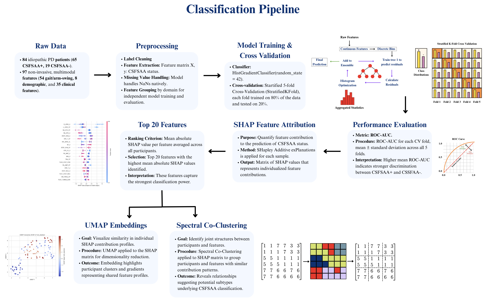
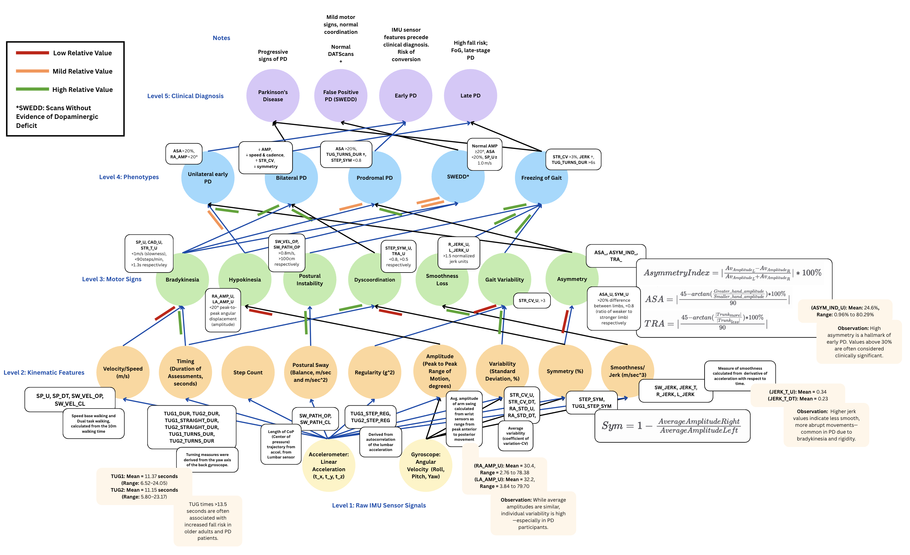

<<<<<<< HEAD
# Non-Invasive_Multimodal_CSFSAA
Multimodal AI for Predicting and Phenotyping Cerebrospinal Fluid alpha-Synuclein Seed Amplification Assay Status in Parkinson's Disease: a Pilot Study
=======
# Multimodal AI for Predicting and Phenotyping Cerebrospinal Fluid $\alpha$-Synuclein Status in Parkinson's Disease: a Pilot Study

The "Non-Invasive_Multimodal_CSFSAA.ipynb" notebook implements a **multimodal machine-learning pipeline** for predicting **CSF $\alpha$-synuclein Seed Amplification Assay (CSFSAA)** status using gait, demographics, clinical, and motor sign features from the PPMI study. It combines **top-down feature-group modeling**, **hierarchical motor-sign construction**, and **COHORT-based stratification** to identify early, remote, and objective markers of Parkinson’s disease.

---

## Objectives

1. **Integrate multimodal patient data** (gait + clinical + demographics features).  
2. **Construct hierarchical motor-sign features** (bottom-up).  
3. **Train ML models** on curated feature groups.  
4. **Evaluate prediction performance** using ROC-AUC and PR-AUC.  
5. **Interpret models using SHAP** to identify important features.  
6. **Compare group-wise, combined, and hierarchical models**.  
7. **Explore latent patient subgroups** using clustering and co-clustering.

## Data Used

- The dataset used: "Gait_Data_with_Selected_Features," was created by merging the following datasets from the PPMI study: **Gait Arm Swing data, PPMI Curated Data Cuts, MDS-UPDRS Part II, Features of Parkinsonism, and Other Clinical Features**
- This dataset contains:
    - Gait features (jerk, cadence, step timing, asymmetry, smoothness, variability).
    - Clinical/cognitive features
    - Demographic data
    - **CSFSAA** label ('0' = negative, '1' = positive)
    - **Cohort Variable**: '1' = PD Participant, '2' = Healthy Control, '3' = SWEDD, '4' = Prodromal. In our dataset, particiapnts with CSFSAA status available were only from the PD or SWEDD cohort (1 or 3)

## Notebook Structure

1. Loads Dependencies
2. Data Loading and Feature Groups
3. Hierarchical Motor-Sign Construction:
    Builds composite metrics for:
    - **Bradykinesia**  
    - **Hypokinesia**  
    - **Asymmetry**  
    - **Dyscoordination**  
    - **Smoothness loss**  
    - **Variability**  
    - **Postural instability**

    Includes:
    - PD vs SWEDD comparisons  
    - Cross-feature correlation analysis  
    - Composite-level heatmaps 
4. Top-Down Modeling Across Feature Groups:
    
    For each feature group:
    - Mean imputation  
    - Optional SMOTE oversampling  
    - Standardization  
    - Histogram Gradient Boosting classifier  
    - Stratified cross-validation  
    - Performance metrics:
    - ROC-AUC (mean $\pm$ SD)  
    - PR-AUC (mean $\pm$ SD)
5. SHAP Model Interpretation:
    For each trained model:
    - Computes SHAP values  
    - SHAP **summary plot**  
    - SHAP **bar plot**  
    - Extracts top **20** most informative features  
    These features later feed into the clustering and co-clustering sections.
6. UMAP Embedding and K-Means Clustering
    - Reduces SHAP value space to 2D  
    - Colors points by a selected SHAP feature  
    - Overlays **CSFSAA** labels  
    - Identifies cluster-specific patterns  
7. Spectral Co-Clustering of Top SHAP Features
    Steps include:
    - Imputation and scaling  
    - Spectral co-clustering (`n_clusters = 3`)  
    - Patient/feature reordering  
    - Heatmap visualization with:
    - Cluster boundaries  
    - Patient subgroup labels  
    - **CSFSAA positivity rates** per subgroup  
    - Feature-cluster annotations  
## Outputs
The notebook produces:
- ROC-AUC & PR-AUC tables across all feature groups  
- SHAP plots for each model  
- Ranking of top predictive features  
- Motor-sign heatmaps and PD vs SWEDD analyses 
- UMAP visualizations of patient clusters   
- Spectral co-clustering heatmaps with CSFSAA augmentation  
## Install Dependencies

`pip install pandas seaborn matplotlib shap umap-learn numpy scipy scikit-learn imbalanced-learn`
>>>>>>> 4b73264 (Initial commit)
